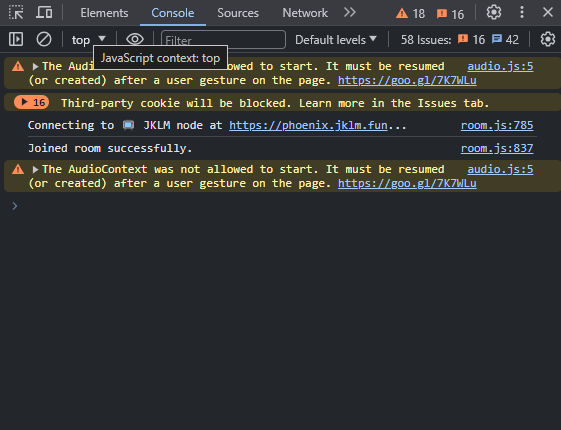
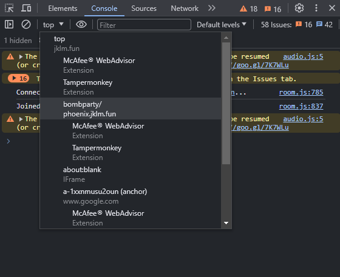

# jklm.fun BombParty Cheat Script

This is a cheat script for https://jklm.fun BombParty game<br />Directly pasting the script in the console wont work, read the usage guide below

## Usage Guide:

-   Steps

1. Open devtools inspect
2. Open the console tab
3. Do one of the following options:
    - Set the Javascript context to bombparty/
    - Using the manual inspect element selection tool, select an element in the center of the game screen
4. Paste the [quick usage script](#quick-usage) or the [full script](index.js) in the console tab and hit enter

-   Visual Guide: Setting javascript context to bombparty/<br />
     

## Options Guide:

You don't have to provide options, as there are default values set.<br />Options can be edited in the beginning of the script code.

| Option Name    | Option Type | Default Value | Description                                                                                         |
| -------------- | ----------- | ------------- | --------------------------------------------------------------------------------------------------- |
| `autotype`     | Boolean     | `true`        | When set true, the word will be automatically typed in your game input, you just have to hit enter  |
| `selfOnly`     | Boolean     | `false`       | When set true, words will be logged in console only when its your own turn                          |
| `lang`         | String      | `"en"`        | You can choose one of the supported languages: en, es, it, fr, de                                   |
| `min`          | Number      | `1`           | Minimum length of words (minimum 1)                                                                 |
| `max`          | Number      | `Infinity`    | Maximum length of words (minimum 1)                                                                 |
| `instant`      | Boolean     | `false`       | When set true, word will be instantly pasted and not typed letter by letter                         |
| `pause`        | Number      | `150`         | Typing pause between letters (in milliseconds) (only effective if "instant" option is set to false) |
| `initialPause` | Number      | `1000`        | The initial pause before typing the word (in milliseconds)                                          |

## Quick Usage

You can paste the script below in the console to run the script quickly with the default options instead of having to copy paste the whole script code. Although, you still have to do the first three steps mentioned in [usage guide](#usage-guide)

```js
fetch(
    "https://raw.githubusercontent.com/MoBakour/jklm-bombparty-cheat/main/index.js"
)
    .then((res) => res.text())
    .then((data) => eval(data));
```

## Dependencies

-   This project makes use of this [API](https://random-word-api.herokuapp.com/)
-   If the script doesn't work. Then either the API is broken, or the game has been updated against the script. Either way [DM](https://discord.com/users/465453058667839499/) me to fix it
